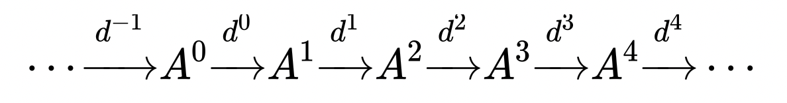
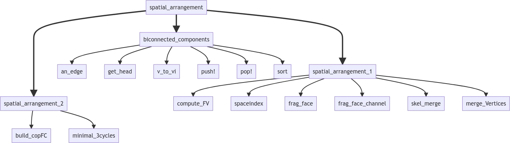
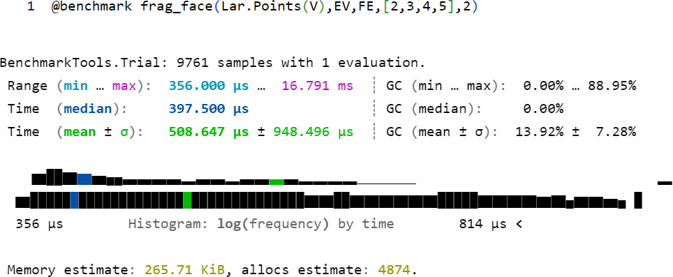

Progetto relativo al Corso di Calcolo Parallelo e Distribuito del 
Prof. Paoluzzi presso l'Università Roma Tre.

Membri del team:
Luca Maria Lauricella e Valerio Marini

Repository del progetto:
https://github.com/lauriluca99/LAR-TGW-3D

# Introduzione Linear Algebraic Rappresentation:

LAR è uno schema rappresentativo per modelli geometrici e topologici. Il
dominio di questo schema consiste in complessi di cellule formati a loro
volta da matrici sparse (matrici con grande affluenza di zeri).
L’analisi di questi complessi cellulari è fatta attraverso semplici
operazioni algebriche lineari, la più comune è la moltiplicazione sparsa
matrice/vettore.

Dato che LAR permette una computazione efficiente di qualsiasi modello
topologico, viene utilizzato con un linguaggio di programmazione,
anch’esso efficiente e veloce, come Julia, il quale permette di sfruttare tutte le
sue potenzialità.

## *Perché LAR?*

Scegliamo LAR in quanto l’aumento della complessità dei dati geometrici
e dei modelli topologici richiedono una migliore rappresentazione e un
modello matematico appropriato per tutte le strutture topologiche. Quindi si ha
un complesso co-chain formato da collezioni di matrici sparse.

Un complesso chain consiste in una sequenza di moduli dove la singola
immagine di ognuno è contenuta nel nucleo della successiva (successivo
conosce precedente).

Un complesso co-chain è la stessa cosa ma con direzioni opposte.

# Obiettivo del progetto
In questo progetto si vuole ottimizzare e parallelizzare il codice dell'algoritmo TGW 3D presente
nella libreria LinearAlgebraicRappresentation.jl 

## **TGW 3D**:

L’algoritmo Topological Gift Wrapping calcola le
d-celle di una partizione di spazio generate da loro partendo da un
oggetto geometrico d-1 dimensionale.

TGW prende una matrice sparsa di dimensione d-1 in input e produce in
output la matrice sparsa di dimensione d sconosciuta aumentata dalle
celle esterne.

# Studio Preliminare

## spatial_arrangement.jl
L'algoritmo TGW 3D è implementato all'interno del file spatial_arrangement.jl

#### Funzioni presenti:

 
**spatial\_arrangement:**

Calcola la partizione dei complessi cellulari dati, con scheletro di
dimensione 2, in 3D.

Un complesso cellulare è partizionato quando l’intersezione di ogni
possibile paio di celle del complesso è vuota e l’unione di tutte le
celle è l’insieme dello spazio Euclideo. La funzione ritorna la
partizione complessa come una lista di vertici V e una catena di bordi
EV, FE, CF.

*spatial\_arrangement\_1:*

Si occupa del processo di frammentazione delle facce per l’utilizzo del
planar arrangement.

1.  <u>compute\_FV:</u>

> Ritorna l’array FV di tipo Lar.Cells dal prodotto di due array sparsi
> in input di tipo Lar.ChainOp.

2.  <u>spaceindex:</u>

> Dato un modello geometrico, calcola le intersezioni tra i bounding
> box. Nello specifico, la funzione calcola le 1-celle e il loro
> bounding box attraverso la funzione boundingBox. Si suddividono le
> coordinate *x* e *y* in due dizionari chiamando la funzione
> coordintervals. Per entrambe le coordinate *x* e *y*, si calcola un
> intervalTree cioè una struttura dati che contiene intervalli. La
> funzione boxCovering viene chiamata per calcolare le sovrapposizioni
> sulle singole dimensioni dei bounding Box. Intersecando quest’ultime,
> si ottengono le intersezioni effettive tra bounding box. La funzione
> esegue lo stesso procedimento sulla coordinata *z* se presente.
> Infine, si eliminano le intersezioni di ogni bounding box con loro
> stessi.

3.  <u>frag\_face:</u>

> Effettua la trasformazione in 2D delle facce fornite come parametro
> sigma, dopo di che ogni faccia sigma si interseca con le facce
> Presenti in sp\_index sempre fornito come parametro della funzione.

4.  <u>skel\_merge:</u>

> Effettua l’unione di due scheletri che possono avere 1 o 2 dimensioni.

5.  <u>merge\_vertices:</u>

> Effettua l’unione dei vertici, dei lati e delle facce vicine.

*biconnected\_components:*

Calcola le componenti biconnesse del grafo EV rappresenato da bordi,
ovvero coppie di vertici.

1.  <u>an\_edge:</u>

> Funzione che, dato in input un punto, prende un lato connesso ad esso.

2.  <u>get\_head:</u>

> Funzione che, dato in input un lato e la coda, fornisce la testa

3.  <u>v\_to\_vi:</u>

> Funzione che, dato un vertice in input, ritorna falso se la prima
> occerrenza della matrice è pari a 0 oppure ritorna il valore trovato.

4.  <u>push!:</u>

> Inserisce uno o più oggetti nella matrice.

5.  <u>pop!:</u>

> Rimuove l’ultimo oggetto nella matrice e lo ritorna.

6.  <u>sort:</u>

> Ordina la matrice e ne ritorna una copia.

*spatial\_arrangement\_2:*

Effettua la ricostruzione delle facce permettendo il wrapping spaziale
3D.

1.  <u>minimal\_3cycles:</u>

> Funzione che riporta i parametri dati in input in 3 dimensioni e
> calcola le nuove celle adiacenti per estendere i bordi della figura
> geometrica. Infine ritorna la matrice sparsa tridimensionale.

2.  <u>build\_copFC:</u>

> Funzione alternativa alla precedente.

# Studio esecutivo

Nello studio esecutivo abbiamo analizzato il codice nei notebooks cercando delle possibili 
ottimizzazioni. Non è stato possibile ottimizzare tutte le funzioni, infatti le principali
modifiche sono state effettuate nelle funzioni:  **frag\_face** e **merge\_vertices**.

Inoltre sul sistema operativo Windows si sono riscontrati diversi problemi con delle librerie.

Per migliorare il codice, sono stati presi in considerazione i libri: *Julia High Performance* e 
*Hands-On Julia Programming*, nei quali vengono menzionate le seguenti macro 
per migliorare le performance e la stabilità del codice:

- @async: racchiude l'espressione in un Task ed 
inizierà con l'esecuzione di questa attività
procedendo con qualsiasi altra cosa venga dopo nello script, senza aspettare 
che il Task termini.

- `@sync`: contrariamente al precedente, questa macro aspetta che 
tutti i Task creati dalla parallelizzazione siano completati prima di proseguire.

- `Thread.@spawn`: Crea un Task e schedula l'esecuzione su un qualsiasi thread disponibile. 
Il Task viene assegnato ad un Thread quando diventa disponibile.

- `@simd`: si utilizza solo nei for per permettere al compilatore di avere
più libertà nella gestione del ciclo consentendo di riordinarlo.

- `@inbounds`: elimina il controllo dei limiti degli array all'interno dell'espressione

- `@views`: converte le operazioni di taglio sull'array in una data espressione per ritornare 
una variabile di tipo View.

- `@code_warntype`: viene utilizzato per individuare i problemi causati dai tipi delle variabili, 
operando conseguentemente con un'assegnazione specifica che riduce la complessità del codice.

- `@benchmark`: questa macro può essere usata solo davanti alle chiamate di funzione.
 Valuta i parametri della funzione separatamente e chiama la funzione più volte per costruire 
 un campione di tempi di esecuzione.
 
- `@btime`: simile a `@benchmark` ma restituisce meno informazioni, quali il tempo minimo 
ed il numero di allocazioni.
 
- `@profile`: questa macro esegue l'espressione collezionando dei campionamenti periodici.
Nei campioni si può vedere la gerarchia delle funzioni ed il tempo di esecuzione di ogni riga.

### frag\_face
Utilizzando la macro `@code_warntype` si individuano molte variabili assegnate al tipo `Any`. 
Questo significa essenzialmente che ci sarà un'allocazione per la posizione della memoria e 
l'indirezione al valore effettivo durante l'esecuzione della funzione.

Tramite ProfileView otteniamo un grafico in cui si ottiene la misurazione temporale di ogni singola riga di codice. 
La larghezza delle barre mostra il tempo trascorso in ogni locazione di chiamata, 
mentre la gerarchia di chiamata è rappresentata dalle varie altezze del grafico.

Per ottimizzare la funzione abbiamo assegnato alle variabili locali un tipo deterministico per rimuovere il tipo `Any`
ed avere la funzione *type-stable*.
Inoltre si possono creare delle viste degli array quando c'è un'operazione di slicing, 
con la macro `@views`, le quali permettono di accedere ai valori dell'array 
senza dover effettuare una copia.

Dopo aver eseguito vari test, si è optato per utilizzare la macro `@async` per parallelizzare
il ciclo *for* che calcola l'intersezione della faccia sigma con le facce in *sp_idx[sigma]*.

Quindi, applicando le suddette modifiche, si è raggiunto un tempo minimo di esecuzione
inferiore di circa 20% dalla versione originale.

### merge_vertices