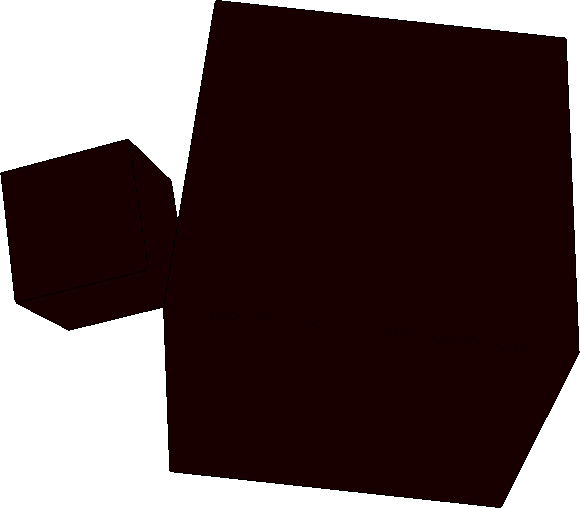

## Esempio `corner.jl`
```julia
using LinearAlgebraicRepresentation
Lar = LinearAlgebraicRepresentation
using ViewerGL, LinearAlgebra
GL = ViewerGL

function viewStruct(V, CV, FV, EV)
	store = [];
	mybox = (V,CV,FV,EV)
	transl = Lar.t(0,1,0.5)
	str = Lar.Struct([ transl, #scale, rot, 
	                    mybox ])
	obj = Lar.struct2lar(str)
	push!(store, obj)

	str = Lar.Struct(store);
	V,CV,FV,EV = Lar.struct2lar(str);

	GL.VIEW([ GL.GLPol(V,CV, GL.COLORS[2], 0.1) ]);

	cop_EV = Lar.coboundary_0(EV::Lar.Cells);
	cop_FE = Lar.coboundary_1(V, FV::Lar.Cells, EV::Lar.Cells);
	W = convert(Lar.Points, V');

	V, copEV, copFE, copCF = Lar.space_arrangement(
		W::Lar.Points, cop_EV::Lar.ChainOp, cop_FE::Lar.ChainOp);

	V = convert(Lar.Points, V');
	V,CVs,FVs,EVs = Lar.pols2tria(V, copEV, copFE, copCF) # whole assembly
	GL.VIEW(GL.GLExplode(V,FVs,1.1,1.1,1.1,99,1));
	GL.VIEW(GL.GLExplode(V,EVs,1.5,1.5,1.5,99,1));
	GL.VIEW(GL.GLExplode(V,CVs[2:end],2,2,2,99,0.2));
end 

V = [0.3229956 0.8459234 0.3091824 0.8321101 0.3233606 0.8462884 0.3095474 0.8324751 0.822632 0.8740866 0.8719075 0.923362 0.9865184 1.0379729 1.0357938 1.0872484; 
0.5770385 0.5632252 0.0548407 0.0410274 0.6046603 0.590847 0.0824624 0.0686491 0.4321656 0.4814411 0.591786 0.6410615 0.368702 0.4179775 0.5283224 0.5775979; 
0.0769021 0.0772671 0.1045238 0.1048888 0.5992825 0.5996475 0.6269042 0.6272692 0.1754594 0.3393458 0.1119958 0.2758822 0.1430863 0.3069727 0.0796228 0.2435091]

CV = [[1, 2, 3, 4, 5, 6, 7, 8], [9, 10, 11, 12, 13, 14, 15, 16]]

FV = [[1, 2, 3, 4], [5, 6, 7, 8], [1, 2, 5, 6], [3, 4, 7, 8], [1, 3, 5, 7], [2, 4, 6, 8], [9, 10, 11, 12], [13, 14, 15, 16], [9, 10, 13, 14], [11, 12, 15, 16], [9, 11, 13, 15], [10, 12, 14, 16]]

EV = [[1, 2], [3, 4], [5, 6], [7, 8], [1, 3], [2, 4], [5, 7], [6, 8], [1, 5], [2, 6], [3, 7], [4, 8], [9, 10], [11, 12], [13, 14], [15, 16], [9, 11], [10, 12], [13, 15], [14, 16], [9, 13], [10, 14], [11, 15], [12, 16]]

viewStruct(V,CV,FV,EV)
```

## Immagini `corner.jl`



