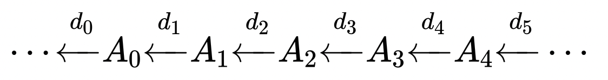

# Introduzione Linear Algebraic Rappresentation:

LAR è uno schema rappresentativo per modelli geometrici e topologici. Il
dominio di questo schema consiste in complessi di cellule formati a loro
volta da matrici sparse (matrici con grande affluenza di zeri).
L’analisi di questi complessi cellulari è fatta attraverso semplici
operazioni algebriche lineari, la più comune è la moltiplicazione sparsa
matrice/vettore.

Dato che LAR permette una computazione efficiente di qualsiasi modello
topologico, viene utilizzato con un linguaggio di programmazione,
anch’esso efficiente e veloce, come Julia, il quale permette di sfruttare tutte le
sue potenzialità.

## *Perché LAR?*

Scegliamo LAR in quanto l’aumento della complessità dei dati geometrici
e dei modelli topologici richiedono una migliore rappresentazione e un
modello matematico appropriato per tutte le strutture topologiche. Quindi si ha
un complesso co-chain formato da collezioni di matrici sparse.

Un complesso chain consiste in una sequenza di moduli dove la singola
immagine di ognuno è contenuta nel nucleo della successiva (successivo
conosce precedente).

Un complesso co-chain è la stessa cosa ma con direzioni opposte.

# Obiettivo del progetto
In questo progetto si vuole ottimizzare e parallelizzare il codice dell'algoritmo TGW 3D presente
nella libreria LinearAlgebraicRappresentation.jl 

## **TGW 3D**

L’algoritmo Topological Gift Wrapping calcola le
d-celle di una partizione di spazio generate da loro partendo da un
oggetto geometrico d-1 dimensionale.

TGW prende una matrice sparsa di dimensione d-1 in input e produce in
output la matrice sparsa di dimensione d sconosciuta aumentata dalle
celle esterne.