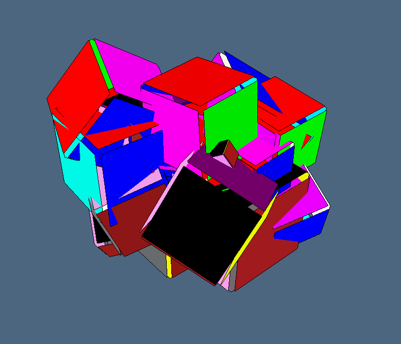
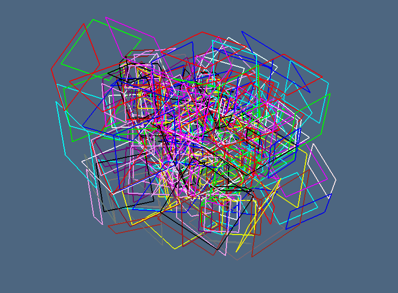

## Esempio `randomcubes.jl`
```julia

using LinearAlgebraicRepresentation
Lar = LinearAlgebraicRepresentation
using ViewerGL, LinearAlgebra
GL = ViewerGL

#include("")
store = [];
scaling = 1.5;
V,(VV,EV,FV,CV) = Lar.cuboid([0.25,0.25,0.25],true,[-0.25,-0.25,-0.25]);
mybox = (V,CV,FV,EV);

for k=1:50
	size = rand()*scaling
	scale = Lar.s(size,size,size)
	transl = Lar.t(rand(3)...)
	alpha = 2*pi*rand()
	rx = Lar.r(alpha,0,0); ry = Lar.r(0,alpha,0); rz = Lar.r(0,0,alpha)
	rot = rx * ry * rz
	str = Lar.Struct([ transl, scale, rot, mybox ])
	obj = Lar.struct2lar(str)
	vs = obj[1]
	diag = LinearAlgebra.norm(vs[:,8]-vs[:,1])
	if diag > 1/5
		push!(store, obj)
	end
end

str = Lar.Struct(store);
V,CV,FV,EV = Lar.struct2lar(str);
# V = Plasm.normalize3D(V) TODO:  solve MethodError bug

include("./MAKEtests.jl")
viewStruct(V,CV,FV,EV)

```


## Immagini `randomcubes.jl`



