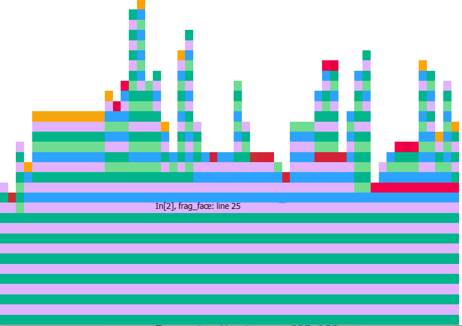
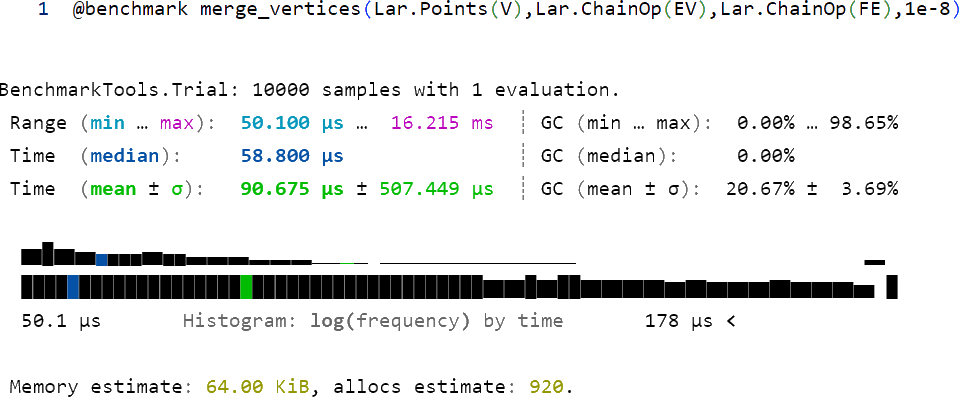

% Relazione LAR TGW 3D - Gruppo 8b
% Luca Maria Lauricella; Valerio Marini;
% \today

Progetto relativo al Corso di Calcolo Parallelo e Distribuito del 
Prof. Paoluzzi presso l'Università Roma Tre.

Repository del progetto:
https://github.com/lauriluca99/TGW-3D.jl

Documentazione del progetto:
https://lauriluca99.github.io/TGW-3D.jl

# Studio esecutivo

Nello studio esecutivo abbiamo analizzato il codice nei notebooks cercando delle possibili 
ottimizzazioni. Non è stato possibile ottimizzare tutte le funzioni, infatti le principali
modifiche sono state effettuate nelle funzioni:  **frag\_face** e **merge\_vertices**.

Per migliorare il codice, sono stati presi in considerazione i libri: *Julia High Performance* e 
*Hands-On Julia Programming*, nei quali vengono menzionate le seguenti macro 
per migliorare le performance e la stabilità del codice:

- `@async`: racchiude l'espressione in un Task ed 
inizierà con l'esecuzione di questa attività
procedendo con qualsiasi altra cosa venga dopo nello script, senza aspettare 
che il Task termini.

- `@sync`: contrariamente al precedente, questa macro aspetta che 
tutti i Task creati dalla parallelizzazione siano completati prima di proseguire.

- `Thread.@spawn`: Crea un Task e schedula l'esecuzione su un qualsiasi thread disponibile. 
Il Task viene assegnato ad un Thread quando diventa disponibile.

- `@simd`: si utilizza solo nei for per permettere al compilatore di avere
più libertà nella gestione del ciclo consentendo di riordinarlo.

- `@inbounds`: elimina il controllo dei limiti degli array all'interno dell'espressione

- `@views`: converte le operazioni di taglio sull'array in una data espressione per ritornare 
una variabile di tipo View.

- `@code_warntype`: viene utilizzato per individuare i problemi causati dai tipi delle variabili, 
operando conseguentemente con un'assegnazione specifica che riduce la complessità del codice.

- `@benchmark`: questa macro può essere usata solo davanti alle chiamate di funzione.
 Valuta i parametri della funzione separatamente e chiama la funzione più volte per costruire 
 un campione di tempi di esecuzione.
 
- `@btime`: simile a `@benchmark` ma restituisce meno informazioni, quali il tempo minimo 
ed il numero di allocazioni.
 
- `@profile`: questa macro esegue l'espressione collezionando dei campionamenti periodici.
Nei campioni si può vedere la gerarchia delle funzioni ed il tempo di esecuzione di ogni riga.

### frag\_face
Utilizzando la macro `@code_warntype` si individuano molte variabili assegnate al tipo `Any`. 
Questo significa essenzialmente che ci sarà un'allocazione per la posizione della memoria e 
l'indirezione al valore effettivo durante l'esecuzione della funzione.

Tramite ProfileView otteniamo un grafico in cui si ottiene la misurazione temporale di ogni singola riga di codice. 
La larghezza delle barre mostra il tempo trascorso in ogni locazione di chiamata, 
mentre la gerarchia di chiamata è rappresentata dalle varie altezze del grafico.

Per ottimizzare la funzione abbiamo assegnato alle variabili locali un tipo deterministico per rimuovere il tipo `Any`
ed avere la funzione *type-stable*.
Inoltre si possono creare delle viste degli array quando c'è un'operazione di slicing, 
con la macro `@views`, le quali permettono di accedere ai valori dell'array 
senza dover effettuare una copia.

Dopo aver eseguito vari test, si è optato per utilizzare la macro `@async` per parallelizzare
il ciclo *for* che calcola l'intersezione della faccia sigma con le facce in *sp_idx[sigma]*.

Quindi, applicando le suddette modifiche, si è raggiunto un tempo minimo di esecuzione
inferiore di circa 20% dalla versione originale.

### merge_vertices
Anche per quanto riguarda questa funzione abbiamo effettuato un controllo su i vari tipi di variabili assegnati utilizzando 
la macro `@code_warntype`, questa volta però non erano presenti variabili di tipo `Any` che ci avrebbero dunque destabilizzato
i tipi della funzione. Per ottimizzare quest’ ultima abbiamo, un’altra volta, introdotto opportunamente davanti ai cicli *for* 
la macro `@async` che, parallelizzando le operazioni di calcolo, ci ha permesso di avere un'ottimizzazione del 30% sul tempo di
esecuzione.

Notiamo in seguito come vengono modificati i tempi dopo l'ottimizzazione.

### spatial_arrangement
Di nuovo, anche per questa funzione è stato effettuato un controllo su i vari tipi di variabili utilizzando 
la macro `@code_warntype`, quindi abbiamo stabilizzato i tipi delle variabili e parallelizzando le funzioni merge_vertices 
e frag_face, che vengono richiamate all'interno della funzione corrente, abbiamo ottenuto un codice che si comporta come una 
versione più veloce del codice precedente risparmiando circa un 40% del tempo di esecuzione.

Notiamo in seguito come vengono modificati i tempi dopo l'ottimizzazione.

### Azioni Github
Grazie all'utilizzo del libro *Hands-On Julia Programming*, in particolare il capitolo 13, si sono costruite diverse `Actions` di Github,
le quali eseguono delle istruzioni specifiche quando Github rileva gli eventi di attivazione corrispondenti. 
Ogni volta che c'è un nuovo `push` sul branch `master`, viene effettuata una simulazione per verificare che il modulo 
`TGW3D.jl` venga correttamente aggiunto sui sistemi operativi Ubuntu (x86 e x64), Windows (x86 e x64) e macOS (x64). 
Inoltre, tramite la libreria `Documenter.jl`, viene presa la documentazione del nostro progetto ed inserita sulla pagina di Github
corrispondente.
